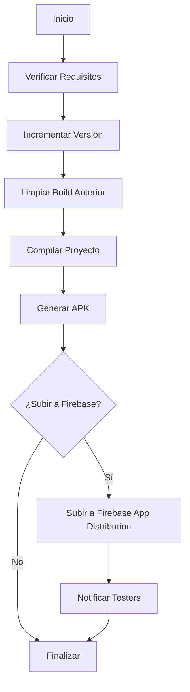

# 🚀 Pipeline de Despliegue Automático - AcuPuntos

Este documento describe el uso del pipeline automatizado para desplegar actualizaciones de AcuPuntos mediante Firebase App Distribution.

## 📋 Tabla de Contenidos

- [Requisitos Previos](#requisitos-previos)
- [Configuración Inicial](#configuración-inicial)
- [Uso Rápido](#uso-rápido)
- [Opciones Avanzadas](#opciones-avanzadas)
- [Configuración de Firebase](#configuración-de-firebase)
- [Resolución de Problemas](#resolución-de-problemas)
- [Flujo del Pipeline](#flujo-del-pipeline)

---

## ⚙️ Requisitos Previos

Antes de usar el pipeline, asegúrate de tener instalado:

1. **✅ .NET SDK** (versión 10.0 o superior)
   ```bash
   dotnet --version
   ```

2. **✅ Node.js y npm** (para Firebase CLI)
   ```bash
   node --version
   npm --version
   ```

3. **✅ Firebase CLI** (opcional pero recomendado)
   ```bash
   npm install -g firebase-tools
   ```

4. **✅ PowerShell** (incluido en Windows)

---

## 🔧 Configuración Inicial

### 1. Configurar Firebase App Distribution

1. Ve a [Firebase Console](https://console.firebase.google.com/)
2. Selecciona tu proyecto AcuPuntos
3. Ve a **App Distribution** en el menú lateral
4. Obtén tu **App ID** (formato: `1:123456789:android:abcdef123456`)

### 2. Autenticarse con Firebase CLI

```bash
# Iniciar sesión en Firebase
firebase login

# Verificar que estás autenticado
firebase projects:list
```

### 3. Configurar el archivo `firebase-deploy-config.json`

Edita el archivo `firebase-deploy-config.json` en la raíz del proyecto:

```json
{
  "firebase_app_id": "1:123456789:android:abcdef123456",
  "release_notes": "Nueva version con mejoras y correcciones",
  "tester_groups": [
    "qa-team",
    "beta-testers",
    "amigos"
  ]
}
```

**Campos importantes:**
- `firebase_app_id`: ID de tu app en Firebase (REQUERIDO)
- `release_notes`: Notas de la versión que verán los testers
- `tester_groups`: Grupos de testers que recibirán la actualización

### 4. Crear Grupos de Testers en Firebase

1. En Firebase Console → App Distribution
2. Click en la pestaña **"Testers & Groups"**
3. Crear grupos: `qa-team`, `beta-testers`, `amigos`, etc.
4. Agregar emails de los testers a cada grupo

---

## 🚀 Uso Rápido

### Opción 1: Doble Click (Más Fácil)

Simplemente haz **doble click** en el archivo `deploy.bat` en el explorador de archivos.

El script automáticamente:
- ✅ Incrementa la versión de la app
- ✅ Compila el proyecto en modo Release
- ✅ Genera el APK firmado
- ✅ Sube el APK a Firebase App Distribution
- ✅ Notifica a los grupos de testers configurados

### Opción 2: Línea de Comandos

```bash
# Despliegue completo (recomendado)
.\deploy.bat
```

---

## 🎯 Opciones Avanzadas

### Usando PowerShell Directamente

El script `deploy.ps1` tiene múltiples opciones:

```powershell
# Ver todas las opciones disponibles
.\deploy.ps1 -Help

# Build de Debug en lugar de Release
.\deploy.ps1 -Configuration Debug

# No incrementar la versión automáticamente
.\deploy.ps1 -SkipVersion

# Usar un APK ya compilado (no compilar de nuevo)
.\deploy.ps1 -SkipBuild

# Solo compilar, NO subir a Firebase
.\deploy.ps1 -UploadToFirebase:$false

# Combinaciones
.\deploy.ps1 -Configuration Debug -SkipVersion -UploadToFirebase:$false
```

### Ejemplos de Uso

#### 1. Despliegue Completo Estándar
```bash
.\deploy.bat
```
- Incrementa versión
- Build Release
- Sube a Firebase
- Notifica testers

#### 2. Build Local sin Despliegue
```powershell
.\deploy.ps1 -UploadToFirebase:$false
```
- Incrementa versión
- Build Release
- **NO** sube a Firebase

#### 3. Subir APK Existente
```powershell
.\deploy.ps1 -SkipBuild -SkipVersion
```
- **NO** incrementa versión
- **NO** compila
- Sube el APK existente a Firebase

#### 4. Build de Debug para Pruebas Locales
```powershell
.\deploy.ps1 -Configuration Debug -UploadToFirebase:$false
```
- Build Debug
- **NO** sube a Firebase

---

## 🔥 Configuración de Firebase

### Obtener Firebase App ID

1. Ir a [Firebase Console](https://console.firebase.google.com/)
2. Seleccionar proyecto **AcuPuntos**
3. Ir a **Project Settings** (⚙️)
4. En la sección de Apps, buscar tu app Android
5. El App ID está en formato: `1:123456789:android:abcdef123456`

### Configurar Grupos de Testers

```bash
# En Firebase Console → App Distribution → Testers & Groups

Grupo: beta-testers
Emails: 
  - amigo1@gmail.com
  - amigo2@gmail.com
  - amigo3@gmail.com

Grupo: qa-team
Emails:
  - tester1@company.com
  - tester2@company.com
```

### Notas de Versión Personalizadas

Edita `firebase-deploy-config.json` antes de cada despliegue:

```json
{
  "release_notes": "🎉 Version 1.2.0\n\n✨ Nuevas Funcionalidades:\n- Modo oscuro implementado\n- Agenda de citas\n- Notificaciones push\n\n🐛 Correcciones:\n- Fix en la barra de estado Android\n- Mejoras de performance"
}
```

---

## 🔍 Flujo del Pipeline



### Pasos Detallados

1. **Verificación de Requisitos**
   - Verifica .NET SDK
   - Verifica Firebase CLI
   - Verifica archivos del proyecto

2. **Incremento de Versión** (opcional, si no se usa `-SkipVersion`)
   - Lee el archivo `.csproj`
   - Incrementa `ApplicationVersion`
   - Guarda los cambios

3. **Build del Proyecto**
   - Limpia builds anteriores: `dotnet clean`
   - Compila: `dotnet build -c Release`
   - Publica: `dotnet publish -c Release`

4. **Generación del APK**
   - Genera APK firmado
   - Muestra tamaño y ubicación

5. **Subida a Firebase** (opcional)
   - Usa Firebase CLI
   - Distribuye a grupos de testers
   - Envía notificaciones automáticas

6. **Resumen**
   - Muestra logs
   - Opción de abrir carpeta del APK

---

## 🐛 Resolución de Problemas

### Error: "Firebase CLI no está disponible"

**Solución:**
```bash
# Instalar Firebase CLI
npm install -g firebase-tools

# Autenticarse
firebase login
```

### Error: "App ID incorrecto"

**Solución:**
1. Verifica el `firebase_app_id` en `firebase-deploy-config.json`
2. Debe tener formato: `1:123456789:android:abcdef123456`
3. Obtener desde Firebase Console → Project Settings

### Error: "No se encontró el APK"

**Solución:**
```bash
# Asegúrate de que el build se completó correctamente
# Verifica la ruta en: bin\Release\net10.0-android\

# O usa el flag para forzar build:
.\deploy.ps1 -SkipBuild:$false
```

### Error: "Build fallido - Errores de Firebase duplicados"

**Solución:**
El proyecto ya está configurado para manejar duplicados. Si persiste:
```bash
# Limpiar completamente
dotnet clean
rd /s /q bin obj

# Rebuild completo
.\deploy.bat
```

### Error: "No tienes permisos en Firebase"

**Solución:**
1. Verifica que tu cuenta de Google tiene acceso al proyecto Firebase
2. Re-autentica: `firebase login --reauth`
3. Verifica permisos en Firebase Console → Project Settings → Users and permissions

### El APK se genera pero no se sube

**Solución:**
```bash
# Verificar autenticación
firebase login

# Verificar que puedes ver el proyecto
firebase projects:list

# Intentar subir manualmente
firebase appdistribution:distribute bin\Release\net10.0-android\*.apk --app YOUR_APP_ID
```

---

## 📊 Logs y Monitoreo

### Archivo de Log

Cada ejecución genera un log en: `deploy-log.txt`

Contiene:
- Output completo del build
- Errores detallados
- Información de la subida a Firebase

### Verificar Despliegue en Firebase

1. Ir a [Firebase Console](https://console.firebase.google.com/)
2. App Distribution → Releases
3. Verificar que la nueva versión aparece
4. Ver testers que han descargado/instalado

---

## 🎨 Personalización

### Cambiar el mensaje de release notes dinámicamente

Edita el archivo antes de cada deploy:
```bash
notepad firebase-deploy-config.json
```

### Agregar más grupos de testers

En `firebase-deploy-config.json`:
```json
{
  "tester_groups": [
    "amigos",
    "familia",
    "qa-team",
    "beta-testers",
    "early-adopters"
  ]
}
```

### Modificar el incremento de versión

Por defecto incrementa solo el `ApplicationVersion` (build number).

Para cambiar también el `ApplicationDisplayVersion`, edita `deploy.ps1` línea ~180:

```powershell
# Cambiar de 1.0 a 1.1, etc.
$versionParts = $currentDisplayVersion -split '\.'
$versionParts[1] = [int]$versionParts[1] + 1
$newDisplayVersion = $versionParts -join '.'
$csproj.Project.PropertyGroup.ApplicationDisplayVersion = $newDisplayVersion
```

---

## 📝 Notas Adicionales

### Versiones

- **ApplicationVersion**: Número de build (incrementa automáticamente)
- **ApplicationDisplayVersion**: Versión visible para usuarios (ej: 1.0, 1.1)

### Tamaño del APK

El pipeline muestra el tamaño del APK generado. Para reducirlo:
- Habilitar AOT: `<RunAOTCompilation>true</RunAOTCompilation>`
- Habilitar Linker: `<AndroidLinkMode>Full</AndroidLinkMode>`
- Habilitar Trimming: `<PublishTrimmed>true</PublishTrimmed>`

⚠️ **Advertencia**: Estas optimizaciones pueden causar problemas con Firebase/Reflection.

### Firma del APK

El APK se firma automáticamente usando la configuración del proyecto.

Para configurar tu propia keystore, edita `.csproj`:
```xml
<PropertyGroup Condition="'$(Configuration)' == 'Release'">
  <AndroidKeyStore>true</AndroidKeyStore>
  <AndroidSigningKeyStore>path\to\your.keystore</AndroidSigningKeyStore>
  <AndroidSigningKeyAlias>your-alias</AndroidSigningKeyAlias>
  <AndroidSigningKeyPass>your-password</AndroidSigningKeyPass>
  <AndroidSigningStorePass>your-password</AndroidSigningStorePass>
</PropertyGroup>
```

---

## 🤝 Soporte

Si tienes problemas:

1. Revisa los logs en `deploy-log.txt`
2. Verifica los pasos de [Resolución de Problemas](#resolución-de-problemas)
3. Asegúrate de tener todos los [Requisitos Previos](#requisitos-previos)

---

## 📜 Licencia

Este pipeline es parte del proyecto AcuPuntos.

**Autor**: Hernan Garcia  
**Fecha**: 2025-11-24  
**Versión del Pipeline**: 1.0
